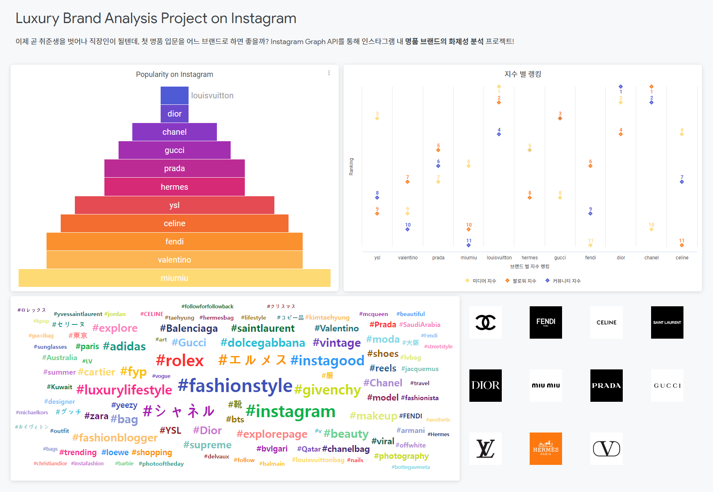
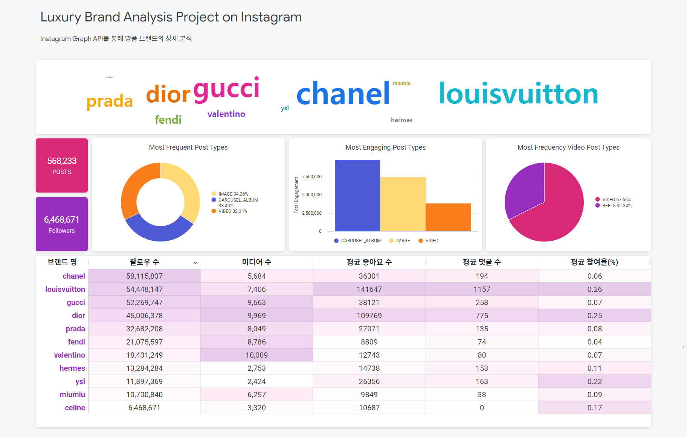
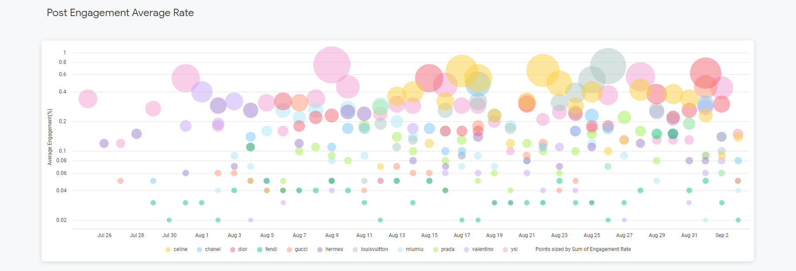
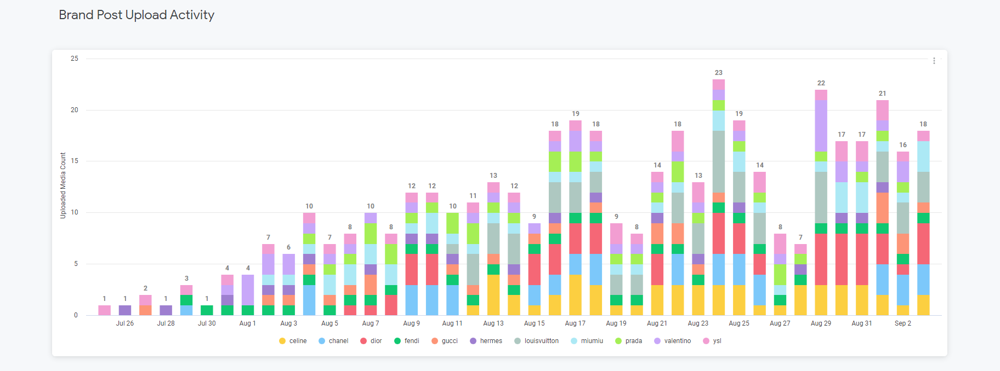
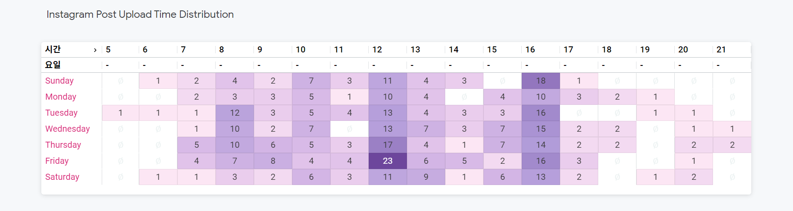

# LuxuryBrands_Looker

### 이용가능 데이터 및 사전 조사
|                                                                                                   |                                                                                                                                                                                                                                                         |
|---------------------------------------------------------------------------------------------------|---------------------------------------------------------------------------------------------------------------------------------------------------------------------------------------------------------------------------------------------------------|
| [비즈니스 검색](https://developers.facebook.com/docs/instagram-api/reference/ig-user/business_discovery) | 비즈니스 계정 팔로워 수, 미디어 수 , 미디어별 코맨트/좋아요 수, 사진                                                                                                                                                                                                               |
| [해시태그 검색](https://developers.facebook.com/docs/instagram-api/reference/ig-hashtag)| 특정해시태그(→ 타겟 brand 이름 등)로 태그된 미디어 가져오기(특정 해시태그의 노드 ID 가져오기, 특정 해시태그가 있는 가장 인기 있는 사진과 동영상 가져오기) 여기서 가져온 게시글 id로 새로운 GET 하기→ 게시글 관련 정보: id, media_type,owner,timestamp, like_count, comments_count, media_url, caption, comment (캡션을 이용해서 워드클라우드 해볼 수 있겠음) |

### 분석 지표 설정
- 참여율(Engagement)(%) = (댓글 수 + 좋아요 수) / (팔로워 수) * 100
- 인기도  = (미디어 지수 + 팔로워 지수 + 커뮤니티 지수) 
  - 인기도 지표를 정의해서 명품브랜드 11개의 실시간 변동 순위 제시
  - 미디어 지수 : 브랜드 인스타그램 미디어의 평균 참여율에 따라 랭킹 부여
  - 팔로워 지수 : 브랜드 인스타그램 팔로워수에 따라 랭킹 부여
  - 커뮤니티 지수 : 브랜드 이름이 해시태그된 미디어의 개수에 따라 랭킹 부여

 

# 대시보드

## 종합 대시보드

1. 인기도 랭킹 차트
2. 인기도 랭킹 계산에 관여하는 3가지의 지수 별 랭킹 차트
3. 브랜드 이름이 해시태그 된 미디어의 연관 해시태그 워드 클라우드

## 반응형 대시보드

1. 차트 상단 필터 기능을 추가 해 원하는 데이터만 조회 가능하도록 구현
2. Cross Filtering을 통해 차트의 특정 영역을 선택하여 연관된 차트를 필터링

### features
- Most Frequent Post Types
  - 미디어 타입 비율 분포
- Most Engaging Post Types
  - 미디어 타입 별 참여율
- Most Frequency Video Post Types
  - 비디오의 업로드 채널 비율

실제로 참여율이 높은 미디어를 피드에 많이 반영을 하는지,
아니면 그렇지 않은지, 릴스 같은 숏폼 컨텐츠에도 적극적으로 뛰어드는지 등의
팩트 체크를 함으로써 각 브랜드의 고유한 온라인 마케팅 전략을 파악 할 수 있음.
   
- Summary
  - 각 브랜드 별 집계한 정보들을 요약 제시
  - 각 컬럼별 값에 따라 색상 그라데이션을 적용하여 한눈에 보이게 끔 함
  - 브랜드 간의 차별화를 확인하고 경쟁 우위를 평가

 
 

### Post Engagement Average Rate

- 브랜드가 올린 미디어의 하루기준 평균 참여율
- 참여율에 비례하여 그래프 점들이 크게 보이게 함.
- 소비자 동향을 파악

 
 

### Brand Post Upload Activity

- 브랜드가 미디어를 포스트하는 개수를 나타냄으로써 게시글 업로드 추이를 볼 수 있음
- 브랜드의 인스타그램 내에서의 활동성을 확인 할 수 있음.

 
 

### Instagram Post Upload Time Distribution

- 브랜드가 미디어를 포스트하는 요일과 시간 분포를 나타냄.
- 브랜드 총계에서는 금요일 12시가 가장 활발한 업로드 시간으로 나타남.
- 요일 상관없이 대체로 12시와 16시 경 가장 많은 업로드가 이루어짐.
